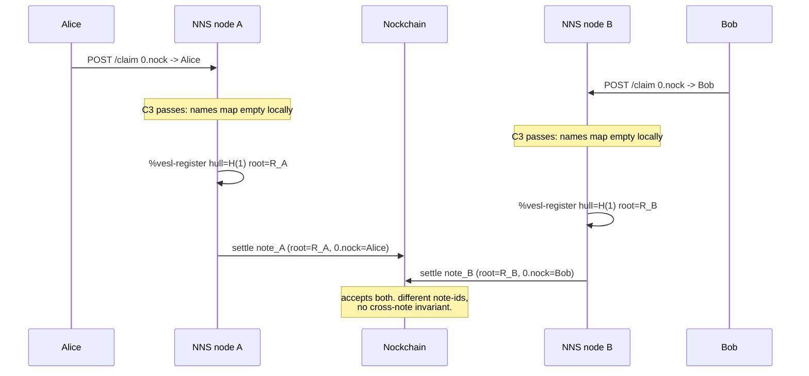
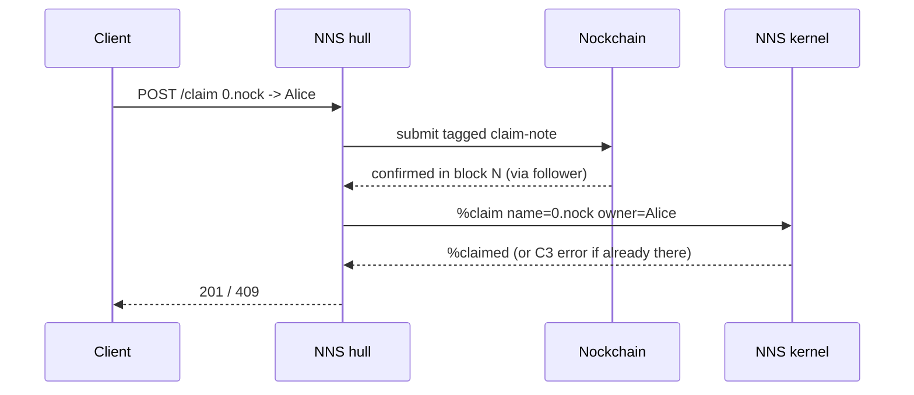
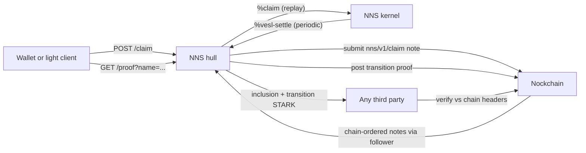

# NNS Consensus Decision

Status: Decision made. Path **A with the `nns-gate` upgrade to provable claim transitions** — full zkRollup shape, stateless light clients, maximum verifiability.
Scope: how NNS moves from a single centralized kernel to an N-node deployment where every honest node agrees on the registry, and any third party can verify ownership without running a full replayer.

This document exists to be argued with. It frames the problem, pins down
what Vesl does and does not contribute, compares four solution shapes on
the same axes, lists the prerequisites that land regardless of which
shape wins, and ends with a recommendation plus the open questions
blocking commitment.

---

## 1. The problem

The current NNS kernel in [hoon/app/app.hoon](../hoon/app/app.hoon) enforces
name uniqueness with one line:

```hoon
?:  (~(has by names.state) name.c)
  :_  state
  ~[[%claim-error 'name already registered']]
```

That is rule **C3** from the README. It is *local*: it reads the
kernel's own `names` map. A kernel running on a different machine reads
its own, independent, `names` map. Nothing in the kernel, the Vesl
graft, or the on-chain settlement note cross-checks those two maps.

### The thought experiment



At the end the chain holds two valid settlement notes, each proving its
own leaves are in its own root. A third-party reader has two
commitments for `claim-id=1` with no protocol rule to pick between
them. That is the consensus gap in concrete form.

### Naming it

What's missing is **a canonical ordering of `%claim` inputs that every
node observes and replays identically**. Bitcoin calls this "the
longest chain." Ethereum calls it "block order." Anything that solves
double-spend solves it by making one input the canonical first, and
every other conflicting input implicitly second (and therefore
rejected). NNS has no such ordering today.

---

## 2. What Vesl does, and what it does not

Vesl is a **verification SDK**, not a consensus protocol. Keeping those
categories clean is the whole point of this section.

### What Vesl provides

- Merkle commitment over `names` via `compute-root` in
  [hoon/app/app.hoon](../hoon/app/app.hoon).
- A STARK-provable gate (`nns-gate`) that attests to **G1** (name
  format) and **G2** (Merkle inclusion) for every leaf in a batch.
- An append-only local graft history (`registered = (map hull root)`)
  and a batch-level replay guard (`settled = (set note-id)`) in
  [hoon/lib/vesl-graft.hoon](../hoon/lib/vesl-graft.hoon).
- A mechanism for publishing settlement notes to Nockchain as
  auditable data (the "Settlement" section of
  [README.md](../README.md)).

### What Vesl does not provide

- **Cross-node agreement on `names`.** Each kernel has its own graft
  state. `settled` dedupes `note-id = hash(sorted batch)` within a
  single kernel. Two kernels with conflicting batches produce
  *different* note-ids and both settle cleanly — neither rejects the
  other.
- **A canonical root.** `registered` on node A maps `H(1) -> R_A`;
  on node B it maps `H(1) -> R_B`. Both are locally consistent.
- **Ordering of `%claim` inputs.** The kernel has no notion of a
  global input stream; it only sees what its hull pokes into it.
- **Protection against the double-registration shown above.** The
  STARK proof is vacuously true on both sides: R_A really does
  contain `0.nock -> Alice`, R_B really does contain
  `0.nock -> Bob`. The proof is not a lie; there are just two
  proofs of two realities.

### Why the existing "provable claim transitions" TODO is necessary but not sufficient

The TODO in [README.md](../README.md) proposes widening `nns-gate` to
attest that a commitment is the deterministic result of applying a
sequence of `%claim` events, each satisfying C1/C2/C3/C4. That is a
strict improvement — it moves C3 and C4 from trusted kernel code into
the STARK. But it does not solve the consensus problem, because
**which sequence** is still a local decision. Node A's claim log
starts with `0.nock -> Alice`; node B's starts with
`0.nock -> Bob`. Both sequences validate under the widened gate.
Both produce valid (and conflicting) commitments.

Provable claim transitions *plus* ordered inputs solves it. Neither
alone does.

### What "verify on chain" actually means on Nockchain

Nockchain is not a smart-contract chain. From
[docs/architecture/tx-engine/04-eutxo-note-data.md](../../nockchain/docs/architecture/tx-engine/04-eutxo-note-data.md)
in the Nockchain repo:

> No validator execution per UTXO: Cardano runs Plutus validators
> when UTXOs are consumed; Nockchain's lock primitives (`Pkh`,
> `Tim`, `Hax`, `Burn`) are fixed opcodes, not arbitrary scripts.
> The note data is not consumed by a user-defined validator.

The README calls the chain an **"app-rollup"** settlement layer.
Concretely, the chain gives you four things: PoW ordering, data
availability (tagged note blobs), value transfer, and four fixed
lock primitives. It does not execute `%claim`. If you post
`nns/v1/claim 0.nock -> Alice` in block N and
`nns/v1/claim 0.nock -> Bob` in block N+3, **the chain stores both**.
C3 still lives in the NNS kernel. The chain's only job is ordering.

With that clear, "verify" splits into three separate claims:

1. **"The chain runs NNS logic."** Not possible on Nockchain.
   Architecturally rejected.
2. **"Every NNS user runs their own replayer."** Fully works.
   Determinism + ordered inputs → every honest full node agrees.
   No Vesl needed for correctness. This is the Bitcoin/Geth
   full-node model.
3. **"A third party verifies NNS state without replaying
   everything."** Requires a proof system. This is Vesl's job.

Option 2 works end-to-end without Vesl. Vesl is only load-bearing
if you also want option 3.

### Vesl's role in Path A

Vesl's function changes between the current design and Path A:

- **Today (centralized kernel).** Vesl proves "the state I committed
  to contains these rows." Weak, because the state itself is not
  canonical — exactly the problem this doc opens with.
- **Path A without Vesl.** Every NNS user or wallet that wants to
  resolve `foo.nock` must either (a) run a full replayer themselves
  (scan Nockchain from genesis, maintain kernel state, handle
  reorgs), or (b) trust whatever NNS server they're querying.
  Option (a) is expensive at the wallet tier; option (b) is
  centralized trust at the edge. The chain is canonical; the
  UX is not.
- **Path A with Vesl, current `nns-gate` (G1 + G2 only).** Vesl
  proves "these rows are in the root I committed to," given some
  registered hull. Leaves open "which root is canonical" unless
  the verifier also trusts that the committing node applied the
  chain-ordered log honestly. Half-measure.
- **Path A with the `nns-gate` upgrade to provable claim transitions
  (the chosen path).** Vesl proves "applying the chain-ordered
  claim notes in blocks `[0..H]` to the empty registry
  deterministically yields root `R`." Any wallet can do
  `GET /proof?name=foo.nock` against an untrusted server, receive
  `(inclusion-proof, transition-STARK, chain-height)`, and verify
  statelessly against the Nockchain header chain it already
  follows. Same relationship as Ethereum L1 to a zkRollup —
  chain orders, app transitions, STARK attests, light client
  trusts nothing but the chain and the verifier.

This is why light-client support (a product requirement for NNS:
anyone should be able to verify a name without running a full node)
pins the decision to **A + the `nns-gate` upgrade**.

---

## 3. The solution space

Four shapes. Each is described the same way: mechanism, finality,
per-claim cost, operational complexity, trust assumptions, failure
modes, and migration story from the current code.

### A. Nockchain as sequencer (parent-chain-ordered L2)

**Mechanism.** A `%claim` is no longer an authoritative HTTP poke. It
is a Nockchain note, tagged (e.g.) `nns/v1/claim`, carrying
`(name, owner, tx-hash, fee-utxo-ref)`. Every NNS node runs a
`ChainFollower` that scans Nockchain forward, extracts tagged notes in
block-then-intra-block order, and pokes `%claim` into the local kernel
in that order. `POST /claim` becomes a convenience that constructs and
submits the claim-note via `nockchain-client-rs`, then waits for the
follower to observe it before returning.



Every other node sees block N, extracts the same note, pokes the same
`%claim`. If two claim-notes for `0.nock` appear in blocks N and N+3
respectively, everyone accepts the N note and rejects the N+3 note
(C3 fires identically everywhere).

- **Finality.** Block time. Exact number TBD (see open questions).
- **Cost per claim.** Chain gas to submit the tagged note + the existing
  fee payment. The two can share the same transaction.
- **Operational complexity.** Moderate. One new long-running task
  (`ChainFollower`); one new code path to construct and submit
  claim-notes; a reorg-handling strategy; a bootstrapping story
  (new node syncs from block 0 or a checkpoint).
- **Trust assumptions.** Inherits Nockchain's. No new trust anchor.
- **Failure modes.** Chain unreachable → `/claim` returns 503
  (retries safe, dedup is automatic via the tagged note ever
  landing or not). Chain reorgs → follower must handle rollback by
  rewinding kernel state to a checkpoint before the reorged height
  and replaying forward. This is the largest engineering item.
- **Migration.** Additive. Keep `%claim` poke semantics unchanged.
  Add the follower + note-submission. Change `POST /claim` from
  "authoritative" to "construct + submit + wait." Existing tests
  still cover kernel correctness; new tests cover the follower and
  reorg handling.
- **Kernel changes.** Minimal. Possibly add a `chain-height`
  cursor to state for reorg-resumption; otherwise unchanged.
- **`nns-gate` survives unchanged.** Vesl settlement remains as-is —
  now commitments are canonical because inputs were ordered.

### B. Commit-reveal on chain

**Mechanism.** Two-phase variant of A. Client first submits
`hash(name, owner, nonce)` on-chain (commit phase, cheap, no name
revealed). After some window, client submits the reveal. Ordering is
by commit note, not reveal note — so an attacker watching the mempool
cannot front-run a commit because they don't know the name yet.

- **Finality.** 2 × block time (commit then reveal), minimum.
- **Cost per claim.** 2 × chain gas.
- **Operational complexity.** A on top of a commit/reveal protocol
  with timeouts (what if someone commits and never reveals?
  Probably: commits expire after N blocks and the slot is free for
  a new commit).
- **Trust assumptions.** Same as A.
- **Failure modes.** Same as A plus: unrevealed commits need a
  reclaim path.
- **Migration.** Same surgery as A plus a second endpoint.
- **When it's worth it.** Only if front-running is a real attack
  for NNS. `.nock` names are not especially time-valuable
  (speculative squatting aside); commit-reveal is overkill at v1
  and can be added later as a compatible extension if squatting
  becomes a problem.

Treat **B as a modifier on A**, not a separate path.

### C. Independent BFT appchain

**Mechanism.** Stand up a validator set (HotStuff / Tendermint / CometBFT-
style BFT consensus) that orders `%claim` messages. Every validator
runs the NNS kernel as deterministic state-machine logic; consensus
produces agreed-upon blocks of ordered claims; Vesl commitments are
posted periodically to Nockchain so external parties can audit
without joining the validator set.

- **Finality.** Sub-second to a few seconds (tunable by validator
  set size and network topology).
- **Cost per claim.** Effectively zero on-chain during normal
  operation; settlement cost amortized across a batch posted
  every N blocks.
- **Operational complexity.** High. You now operate a blockchain:
  validator signing keys, stake accounting and/or slashing (if
  permissionless), p2p networking, block propagation, a
  versioned protocol with hard-fork machinery, fork-choice rules,
  liveness during validator churn, DoS protection. The existing
  Vesl/NockApp hull is not shaped for this.
- **Trust assumptions.** Honest majority (2/3+) of the validator
  set. You must bootstrap a credible set, decide on entry
  conditions, and secure the economic incentives.
- **Failure modes.** Byzantine validators, network partitions,
  validator-set takeover. The usual L1 concerns, scaled to
  whatever minimum set you can assemble.
- **Migration.** Heavy. The kernel stays as the state machine but
  everything around it (the HTTP hull, settlement path, note
  posting) is restructured. You are building a new product.
- **When it's worth it.** If A's claim latency (one block) is
  unacceptable for UX, and per-claim gas is prohibitive at
  target volume, *and* you have an operator community ready to
  run validators.

### D. Rollup with sequencer + fraud proofs

**Mechanism.** One (potentially rotating) sequencer accepts `%claim`
HTTP pokes, orders them in its own queue, periodically posts
Vesl commitments to Nockchain. A challenge window lets any party
prove an earlier conflicting claim existed in the sequencer's input
stream. If a challenge succeeds, the sequencer is slashed and the
state rolled back.

- **Finality.** Soft-confirmed at sequencer time; hard-confirmed
  after challenge window (hours to a day, typical).
- **Cost per claim.** Amortized chain gas — a batch of claims
  costs one settlement note.
- **Operational complexity.** High, but in a different place than
  C. Instead of consensus, you build: sequencer incentives, a
  fraud-proof system (ability for any observer to prove a claim
  was not the first for a given name), data-availability
  (observers need the full input log to challenge), and rotation
  logic.
- **Trust assumptions.** Single honest challenger (1-of-N).
  Weaker than C's honest majority, but relies critically on DA:
  if the sequencer withholds the input log, no one can challenge.
- **Failure modes.** Sequencer censorship (solvable: let users
  submit directly to chain when censored, degrading toward A
  semantics). DA failure. Mass-challenge griefing.
- **Migration.** Substantial. You build a sequencer service,
  a challenge protocol, a DA story. Kernel largely unchanged.
- **When it's worth it.** High-throughput scenarios where A is
  too expensive, but you want to avoid C's operational weight.
  For NNS at current scale this is probably overkill.

---

## 4. Comparison

Same axes, all four paths.

- **Finality.**
  - A: 1 block.
  - B: 2 blocks.
  - C: sub-second.
  - D: sequencer-time soft / challenge-window hard.

- **Cost per claim.**
  - A: 1 × chain gas + fee (share one tx).
  - B: 2 × chain gas + fee.
  - C: ~0 during normal operation; amortized settlement.
  - D: amortized chain gas (1 batch posting per N claims).

- **New protocol code.**
  - A: small (follower + note schema + reorg handler).
  - B: A + commit-reveal state machine + expiry.
  - C: large (full BFT protocol, p2p, validator management).
  - D: medium-large (sequencer + fraud-proofs + DA).

- **Trust assumptions.**
  - A: Nockchain's.
  - B: Nockchain's.
  - C: honest 2/3 of validator set.
  - D: 1-of-N honest challenger + DA.

- **Does the existing `claim-id` ladder survive?**
  - A: yes (maps onto chain order).
  - B: yes.
  - C: yes (maps onto BFT block order).
  - D: yes (maps onto sequencer sequence number).

- **Does `nns-gate` survive unchanged?**
  - A: yes.
  - B: yes.
  - C: yes.
  - D: yes, but needs augmentation for fraud-proof verification.

- **Where Vesl fits.**
  - A: unchanged. Settlement notes become canonical because inputs
    were ordered.
  - B: unchanged.
  - C: supplemented. Vesl settlement is auditability-for-outsiders;
    canonical state is BFT consensus.
  - D: supplemented. Vesl commitments *are* the rollup's posting
    mechanism; fraud proofs use them as checkpoints.

---

## 5. Path-agnostic prerequisites

These land regardless of which shape you pick.

1. **Real on-chain settlement posting.** The "To post settlements to
   Nockchain" section in [README.md](../README.md) is currently stubbed
   (`settlement_mode = "local"`). Every path depends on the hull
   actually talking to Nockchain. Wire `%vesl-settled` effects into a
   Nockchain note submission via `nockchain-client-rs`. Flip
   `settlement_mode` to `fakenet` / `dumbnet`. Surface transient
   failures as `503`.

2. **Real payment verification.** The TODO "Verify address ownership
   via payment" replaces [src/payment.rs](../src/payment.rs)'s
   `verify` stub with a chain lookup that confirms
   `(sender == address, recipient == treasury, amount >= fee)`
   under a single tx. Every consensus path assumes the fee is real;
   without this, fee-tier C2 is theater. Payment-replay (C4) already
   protects against reuse once payment is real.

3. **Claim-note schema.** *(A/B/D only.)* Define the Nockchain note
   format that encodes `(name, owner, tx-hash)` as chain payload,
   with a tag prefix the follower can filter on. This is the smallest
   chunk reusable across A, B, D. Candidate shape: a Nockchain
   NoteData entry with header `'nns/v1/claim'` and body
   `jam([name owner tx-hash])`.

4. **Deterministic replay harness.** *(A/B/D only.)* A test harness
   that feeds a canned sequence of chain-observed claim-notes (in
   various arrival orders) to a fresh kernel and asserts the same
   final root regardless of wall-clock ordering. This is the contract
   a chain-sequenced NNS must satisfy; catching drift here is far
   cheaper than catching it live.

Prerequisites 1 and 2 are the highest-value independent items: both
are already tracked in the README TODO list, both unblock every path,
and both are useful even if you never decentralize.

---

## 5a. Phase 2 — chain-input plumbing (2026-04-24)

Landed:

- **Kernel anchored-chain cursor.** `hoon/app/app.hoon` grew an
  `anchored-chain` field (`tip-digest`, `tip-height`) plus a new
  cause `%advance-tip headers=(list anchor-header)`. Kernel
  enforces strict parent-chain linkage: every new header's
  `parent` must equal the previous header's `digest`, heights must
  increment by 1, and the first header must chain to the current
  tip (or be `parent=0` when bootstrapping). Violations emit
  `%anchor-error` and do not mutate state; the follower treats
  those as "reorg I did not replay cleanly" signals and fails fast.
  Intermediate headers are discarded after validation — the kernel
  stores only the current tip, matching the zkRollup-on-L1 analog
  where the rollup commits to one state root on L1 rather than
  re-encoding L1's header chain locally.
- **Payment-address freeze.** A new `%set-payment-address address=@t`
  cause stores a `(unit @t)` that the Phase 3 C5 predicate will pin
  every claim payment against. The kernel refuses to change it after
  `claim-count > 0`, so an operator cannot silently move the treasury
  target once users have started paying in.
- **Follower anchor-advance loop.** The hull's background follower
  (`src/chain_follower.rs`) runs a second ticker every 10 s:
  peek `/anchor`, ask `GetBlocks` for the current chain tip, fetch
  `[current_anchor+1 .. min(tip - finality_depth, current_anchor +
  max_batch)]` via `GetBlockDetails`, and poke `%advance-tip`. Default
  finality depth is 10 blocks; default max advance batch is 64
  headers. Local mode and endpoints without a chain are no-ops.
- **Claim-note schema extension.** `ClaimNoteV1` now carries an
  optional `ClaimChainBundle { raw_tx_jam, page_jam, block_proof_jam,
  header_chain_jam }`. Absent fields are indistinguishable from a
  legacy note on the wire (backward-compatible in local mode); a
  Phase 3-strict follower will require `is_complete()` in non-local
  mode and reject pre-anchor claims.
- **Tests.** `tests/phase2_anchor.rs` covers bootstrap, extend,
  parent-mismatch, height-gap, internal-break, empty-advance, address
  one-shot bind, pre-claim re-bind, and post-claim freeze (9 cases).
  Plus 3 new unit tests for the claim-note chain-bundle roundtrip.

This is pure plumbing: the anchor and payment-address fields are
stored but not yet read by the gate. Phase 3 lights them up by
embedding `verify:sp-verifier` over the attached `block-proof_jam`
and enforcing C5 against `payment-address`.

---

## 6. Decision

**Path A (Nockchain as sequencer), with the `nns-gate` upgrade to
provable claim transitions.** Light-client verifiability is a
product requirement — anyone should be able to verify a `.nock`
name without running a full replayer — and that requirement pins
the choice. Path A alone gives us canonical ordering; the
`nns-gate` upgrade turns NNS into a zkRollup whose state is
stateless-verifiable against the Nockchain header chain.

Reasoning:

- **Existing code is already shaped like a replayer.** The `claim-id`
  counter in [hoon/app/app.hoon](../hoon/app/app.hoon) is already a
  monotonic log index. `%claim` is already idempotent given the
  same input and state. The kernel does not need to change shape —
  it needs an ordered input stream, which the chain provides.
- **C4 (payment uniqueness) already depends on chain truth.** Once
  prerequisite 2 lands, `tx-hash` is a chain-fact. Promoting the
  claim itself to a chain-fact is a natural extension, not a
  category change.
- **Provable claim transitions compose cleanly on top of A.** The
  chain is the claim log; the upgraded gate attests that the
  commitment is the deterministic fold of that prefix of the log
  into the empty registry. C3 and C4 move from trusted kernel
  code into the STARK.
- **No new trust anchor.** We do not take on the responsibility
  of operating a consensus protocol. Nockchain already does that
  job; NNS inherits it.
- **Migration is additive.** The HTTP surface is preserved. The
  kernel is largely untouched in shape. The new surface area is:
  a `ChainFollower` task, a claim-note constructor, reorg
  handling, and the widened `nns-gate`.

Shape of the resulting system, end-to-end:



Caveats that must be measured early (these become entries in
section 7's open questions and are gating for implementation):

- **Claim latency = block time.** If Nockchain block time is 60+
  seconds under realistic load, `POST /claim` is a poor UX. If it
  is ~10s or lower, it is fine. Measure on fakenet.
- **Chain gas per claim.** At fee tiers of 100/500/5000 nocks, is
  there enough margin to pay chain gas without repricing? Measure
  current chain fee, don't assume.
- **Reorg handling.** A claim that lands at height H then gets
  reorged out is a real case. The follower must be able to rewind
  kernel state to a checkpoint before H and replay forward. The
  existing `NockApp::save_blocking` checkpoints in
  `.nns-data/checkpoints/` are the right mechanism; the follower
  just needs to keep enough of them.
- **Proving cost.** The `nns-gate` upgrade widens the STARK to
  attest a fold of N claim events. Proving time grows with
  settlement batch size. Batching cadence becomes a tunable.

### Paths not taken, and why

- **A without the `nns-gate` upgrade.** Rejected because it breaks
  the light-client requirement: clients would have to trust the
  server they query.
- **B (commit-reveal).** Not needed at v1. `.nock` names are not
  especially time-valuable. Add later as a compatible extension
  if front-running is observed.
- **C (independent BFT appchain).** Rejected: it requires standing
  up and securing a validator set; this is a new product, not an
  incremental step. Reconsider only if A's measured latency fails
  UX AND per-claim gas is prohibitive AND a credible operator
  community exists.
- **D (rollup with fraud proofs).** Rejected in favor of the zk
  variant of A: with the `nns-gate` upgrade we get cryptographic
  finality instead of a challenge window, which is a better
  match for name-registry semantics ("my resolution is correct"
  should not have a week-long challenge caveat).

---

## 7. Open questions

These must be answered before committing to A.

- **What is Nockchain's block time under realistic load, and is it
  acceptable for `POST /claim` UX?** Target: measurement from a live
  fakenet / dumbnet run. Acceptable upper bound: ~15s. Beyond that,
  reconsider.
- **Does Nockchain support arbitrary-data notes with a tag prefix
  usable as a filter?** Skim `crates/nockchain-api` and
  `crates/nockchain-wallet` in `~/nockchain`. If tagged data notes
  are not first-class, design a convention (first N bytes of
  `NoteData` = tag) and validate against the chain client's
  capabilities.
- **Pricing.** Does the current fee tier (5000/500/100 nocks) cover
  chain gas at the A design? If not, re-tier or subsidize from
  treasury. Treat as a measurement, not an assumption.
- **Reorg depth.** What is a realistic maximum reorg depth on
  Nockchain in practice? That bounds how many kernel checkpoints
  the follower must retain.
- **Bootstrapping.** For a new NNS node joining the network: does it
  sync from block 0 (full replay), or from a trust-minimized
  snapshot (some committee-signed or STARK-attested checkpoint)?
  This does not block v1 but should be thought through before
  choosing a checkpointing story.
- **(For C only, if reconsidered later.)** What is the minimum
  validator set size to bootstrap, and is there a credible
  operator community?
